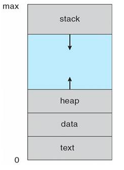
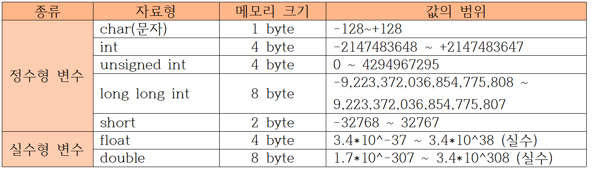

# C

[open tutorials](https://opentutorials.org/module/5371/30467)  

## 1. C언어의 기초

### 1-1. include와 헤더 파일

헤더 파일이란 C언어의 함수, 변수, 매크로, 데이터 구조 등의 선언을 가지고 있는 파일이다. 이러한 선언들로 인해 컴파일러는 프로그램의 다른 부분에서 작성된 코드를 어떤 형식으로 사용하는지 알게 된다.

    // 해더파일 삽입 방법
    #include <stdio.h>
    #include <stdlib.h>

### 1-2. main 함수

C언어로 작성된 프로그램은 main()함수부터 시작하게 된다. 만약 main()함수의 반환값을 정하지 않으면 무조건 0으로 반환된다.

    #include <stdio.h>
    #include <stdlib.h>

    int main() {
        // coding 
        return 0;
    }

### 1-3. 세미콜론과 주석 달기

함수 안에서는 무조건 문장 하나가 끝날 때 세미콜론(;)을 붙여줘야 한다.(함수 바깥에서는 예외 존재) 그렇지 않으면 컴파일러가 컴파일 하지 못한다.  

    // 한줄 전체 주석

    /* 이 주석은 시작과 끝이 나타나 있어서 이 뒤에 코드를 작성 할수 있다. */ printf("hello world")

### 1-4. 변수

    int a;                  // a는 정수형 변수이고, 값은 미정이다. 
    float f = 0.123456;     // f는 실수형 변수이고, 값은 0.123456이다.
    char c = 'A';           // c는 문자형 변수이고, 값은 'A'이다.
    char C = 65;            // C는 문자형 변수이고, 값은 'A'이다. (아스키코드 상의 값)
    char s[6] = "Korea";    // s는 문자열이고, 값은 {K, o, r, e, a, NULL}이다. 

### 1-5. 변수의 형태

- int: (-21억 ~ +21억)
- unsigned int: (1 ~ 42억)
- float: (-21억 ~ +21억, 소숫점 6자리 까지만)
- char: (ASCII, 문자의 번호)
- string: (문자열)

### 1-6. 상수 #define

    #define A 10    // 상수 A에 10 할당

### 1-7. 알고 있으면 유용한 함수들

    #include<math.h>

    // 이 함수를 사용하기 위해서는 double로 cast 해줘야한다.
    double var1 = abs(x);       // x의 절대값
    double var2 = pow(x,y);     // x의 y제곱
    double var3 = sqrt(x);      // 루트 x

 
 

## 2. 입력과 출력

### 2-1. 출력 함수 : printf

    printf("hello world!");

### 2-2. 변환 문자와 기호 문자

    printf("%d", 134)       출력 >> 134
    printf("%f", 0.1)       출력 >> 0.100000
    printf("%g", 0.1)       출력 >> 0.1
    printf("%c", 'a')       출력 >> a
    printf("%s", "hello")   출력 >> hello
    printf("5%%");          출력 >> 5%

### 2-3. 입력 함수 : scanf

    int a, b;               // 정수타입의 a, b 선언
    scanf("%d %d", &a, &b); // scanf 함수로 a, b의 값을 사용자의 입력값으로 정한다.
    printf("%d %d", a, b);  // printf 함수로 a, b의 값을 출력한다.

### 2-4. cast 연산자
cast는 프로그래밍에서 데이터 타입을 다른 데이터 타입으로 변환하는 작업을 말한다.

    int a = 65; 
    // 정수형이였던 a를 (char) cast연산자를 사용해서 문자형으로 변환
    printf("%c", (char)a);  출력 >> a

 
 

## 3. 조건문

### 3-1. 조건식
C언어는 조건식이 참일 때는 1을 반환하고, 거짓일 때는 0을 반환한다. 다른 숫자들도 0만 아니면 참으로 인식한다.

    int a=1, b=2;

    a == b;     출력 >> 0 
    a != b;     출력 >> 1
    a > b;      출력 >> 0
    a < b;      출력 >> 1
    a >= b;     출력 >> 0
    a <= b;     출력 >> 1

    a == b && a <= b;   출력 >> 0
    a == b || a <= b;   출력 >> 1
    !a == b;            출력 >> 1

### 3-2. 조건 연산자(삼항 연산자)

    (조건식) ? 참일 때 반환값 : 거짓일 때 반환값;

### 3-3. if문(조건문)

    if (조건식1){
        // 코드 블록 1
    }
    else if (조건식2){
        // 코드 블록 2
    }
    else {
        // 코드 블록 3
    }
    
### 3-4. switch-case(정렬 조건문)

    switch (조사할 변수) {   
    case constant1:
        // 코드 블록 1
        break;          // break 쓰지 않으면 그 밑으로 쭉 내려가면서 실행된다.
    case constant2:
        // 코드 블록 2
        break;
    default:
        // 만약 어떤 case에도 해당하지 않을 때 실행할 코드
    }

 
 

## 4. 반복문

### 4-1. for : 횟수로 반복하는 방법

    // 10번 반복하는 코드
    for(int i = 0; i < 10; i++){
        // 코드 블록
    }

### 4-2. while : 조건으로 반복하는 방법

    // 조건식이 참인 경우 반복
    while(조건식){
        // 코드 블록
    }

### 4-3. do-while

    // 일단 한 번 실행하고, 조건식이 참인 경우 반복 
    do {
        // 코드 블록
    }while(조건식)

### 4-4. break, continue

    continue;   // 밑에 코드를 무시하고 다음 반복으로 넘어가기
    break;      // 반복문 탈출하기

### 4-5. 반복문의 활용

#### EOF(End of File) 매크로 상수
EOF는 파일의 끝을 나타내거나 입력 작업을 종료할 때 사용되는 매크로 상수이다. <stdio.h>에서 #define(상수)으로 EOF를 정의해놨다.  
C언어에서는 -1로 표현되지만, 파일에서 데이터를 읽을 때, EOF가 나타나면 파일의 끝에 도달했음을 의미하고, 입력 중에는 사용자가(^Z)를 누르면 EOF로 받아들여 입력이 끝났음을 알릴 수 있다.

    int a;
    while(1){
        scanf("%d", &a);
        
        // EOF 입력이 들어오면 중지하는 조건문
        if(a == EOF){
            break;
        }
        else{
            pritnf("%d", a * 2);
        }
    }

#### 유클리드 호제법
유클리드 호제법은 두 수의 최대 공약수를 소인수분해 없이 구할 수 있는 방법이다.  
- 두 수 중에서 큰 수를 a, 작은 수를 b라고 하고 a를 b로 나눈다.
- a가 b로 나누어떨어지면, 두 수의 최대 공약수는 b이다.
- a가 b로 나누어떨어지지 않으면, a를 b로 나눈 나머지와 b에 대해 1번부터 다시 반복한다.
######
    int a, b, c, d, e, gcd, lcm;

    while (1)
    {
        scanf("%d %d", &a, &b);

        if(a == 0 || b == 0)
        {
            printf("END");
            return 0;
        }
        if(a > b)
        {
            c = a;
            d = b;
        }
        else
        {
            c = b;
            d = a;
        }

        while (1)
        {
            e = c % d;
            if(e == 0)
            {
                gcd = d;
                lcm = a * b / gcd;
                printf("%d %d\n", gcd, lcm);
                break;
            }
            c = d;
            d = e;
        }
    }

 
 

## 5. 배열

### 5-1. 배열의 특징과 선언 방법

    int a[10];          // 정수타입 10칸 짜리 배열 a 선언
    a[0] = 1;           // 배열a의 0번 인덱스에 1 할당
    int b[10] = {0, };  // d 배열의 값은 모두 0
    int c[10] = {1, 2, 3, 4, 5, 6, 7, 8, 9, 10};    // 값 목록으로 생성하기
    int d[] = {1, 2, 3, 4, 5};   // 배열의 크기를 명시하지 않고 값 목록으로 생성하면 값 목록 개수가 배열 크기가 됨

    char s[6] = "HELLO";    // s는 문자열이고 값은 H, E, L, L, O, NULL   

### 5-2. 다차원 배열

    int a[3][4];    // 세로 3칸, 가로 4칸의 2차원 배열 선언
    int b[2][3][4]; // 깊이 2칸, 세로3칸, 가로4칸 배열 선언

### 5-3. 문자열 

#### NULL
문자열 함수 및 루프에서 문자열을 처리할 때 안정성을 보장하기 위해 문자열의 마지막에 NULL을 위치시킨다.   
문자열의 끝을 알려지주 않으면 프로그램이 문자열의 끝을 어떻게 인식해야 하는지 알 수 없기 때문이다.

    char c[6] = "hello";
    int i;
    for(i = 0; c[i] != NULL; i++){
        printf("%c", c[i]);
    }

#### gets, puts

    char c[10];
    char s[10];
    
    scanf("%s", c); // 한줄에 다 입력해야 받아들일 수 있다.
    fgets(s);       // 한줄에 다 입력하지 않아도 받아들일 수 있다.
    puts(s);        // 문자열 출력 및 자동 개행

#### #include <string.h>

    #include <string.h>    

    // 문자열 copy
    strcpy(붙여넣기할 문자열, 복사할 문자열);

    // 문자열 concat (NULL은 합쳐진 뒤 맨뒤에 하나만 생성)
    strcat(앞의 문자열, 뒤에 붙일 문자열);

    // 두 문자열 간의 대소문자 비교 (앞배열이크다면1, 같다면0, 같지않다면-1 반환)
    strcmp(문자열1, 문자열2);

    // 문자열 검색 (검색하는 문자열 찾으면 그 뒤로 쭉 반환)
    strchr(문자열, '찾으려는 문자');

    // 문자열 길이 (NULL 제외하고 문자열 길이 반환)
    strlen(문자열);

### 5-4. 배열의 활용편

#### #include <time.h>
    #include <stdio.h>
    #include <stdlib.h>
    #include <time.h>
    
    int main() {
        // 현재 시간을 시드로 사용하여 초기화
        srand(time(NULL));
    
        // 1에서 100까지의 난수 발생
        int random_number = rand() % 100 + 1;
    
        printf("Random Number: %d\n", random_number);
    
        return 0;
    }

#### Select Sort

 
 

## 6. 함수

### 6-1. 나만의 함수 만들기

    // 반환값이 없는 경우 함수형을 void로 한다.
    void 1_plus_2(){
        printf("%d", 1+2);
        return;
    }

    int main() {
        1_plus_2();
    }

### 6-2. 선언과 정의

    int add(int a, int b){
        return a+b;
    }

    int main() {
        add(1, 2);
        return 0;
    }

위와 같이 선언과 정의가 동시에 되어 있으면 main함수를 보기 어려워진다. 따라서 위에서 함수를 선언만 해두고 함수는 밑에서 따로 정의하기도 한다.

    int add(int a, intb);

    int main() {
        add(1, 2);
        return 0;
    }

    int add(int a, int b) {
        return a+b;
    }

### 6-3. 매개변수
함수에 매개변수로 배열을 입력하는 경우 배열의 길이는 비워둔다. 단, 다차원 배열의 경우 첫번째 배열만 비워두고 2번째, 3번째 부분은 정확히 채워야한다.

    int ArrSum(int array[]);
    int ArrXArrSum(int array[][10]);

### 6-4. 재귀함수

#### 재귀함수의 특징과 선언 방법
재귀 함수는 return을 활용해 처음으로 돌아가는 무한루프 함수이다. 

    // 팩토리얼
    int factorial (int n) {
        if (n == 1) return 1;
        return n * factorial(n-1);
    }

### 6-6. 재귀함수의 활용

#### 유클리드 호제법(2)

    int gcd(int a, int b) {
        if (b == 0) return a;
        return gcd(b, a % b);
    }

#### 피보나치 수열

    int fibo(int n) {
        if (n <= 2) return 1;
        return fibo(b-1) + fibo(n-2);
    }

 
 

## 7. 포인터

### 7-1. 포인터 변수와 주소값; 참조와 역참조

    // 포인터 변수 선언
    int *p;         // 아스터리스크(*)는 이 변수가 포인터라는 것을 의미한다. 
    
    int a, *pa;     // 변수 a와 포인터 pa를 선언한다.
    pa = &a;        // &기호는 '참조 연산자'(주소 연산자)이다. &a는 변수 a의 주소값을 의미한다.
    *pa = 100;      // 이때의 아스터리스크(*)는 '역참조 연산자'이다. *pa는 pa가 가지고 있는 주소값에 *를 붙이게 되면 그 변수의 값의 값을 의미한다. 
    printf("%d", a);    >> 100

### 7-2. 포인터와 함수; Call by Reference

    int add(int *x, int *y) {   // 매개 변수가 포인터가 되어 함수가 작동할 때 a,b의 실인수값이 바뀌게 된다.
        *x += *y;
        return *x;
    }    

    int main() {
        int a = 5, b = 5;
        printf("%d %d", add(a, b), a);  >> 10 10
    }

### 7-3. 구조체 포인터; 포인터 연산자

    typedef struct {
        int rotation;
        double r;
    }circle;

    int main() {
        circle c = {10, 3};
        circle *pc = c;
        (*pc).rotation = 12;    // (*pc)는 *가 역참조 연산자임을 강조하기 위한 것
        pc->rotation = 10;      // 화살표(->)는 위의 괄호를 쓰기 귀찮아서 만든 구조체 포인터 연산자
    }

 
 

## 8. 구조체

#### 구조체의 뜻과 종류; struct와 typedef struct
구조체는 직접 변수의 형태를 만들 수 있게 해준다. 구조체에는 struct와 typedef struct 2가지가 있다.

    struct student_info{
        int number;
        char name[20];
        int age;
    }
    
    int main(){
        struct student_info s = {1, "Hong gill dong". 12};
        s.number = 10;  // s 구조체 안에 있는 number를 지칭하여 수정
    }
######
    typedef struct {
        int num;
        char grade;
    }student;       // typedef struct는 구조체 이름이 중괄호 뒤에 위치한다.

    int main(){
        student s = {1, 'A'};   // typedef struct는 변수 앞에 struct라고 명시하지 않아도 된다.(구조체 이름은 명시)
    }

#### 포인터 구조체
포인터 구조체는 구조체 안에 퐁니터를 넣어서 만든 구조체이다.

    typedef struct {
        int *data;
        Node *link; // 자기참조 구조체
    }Node;

    int main(){
        Node list;
        list.data = 123456789 * 63  // 
    }

## 9. 포인터 복습
포인터는 변수이다. 값을 저장하는 일반 변수와 달리 메모리 주소를 저장한다는 점이 다를 뿐이다. 포인터는 아래와 같이 데이터 형식 뒤에 *를 붙여서 선언한다.

    데이터형식* 포인터;          // 데이터형식을 저장하는 포인터 선언
    int* ptr;               // int 형식 메모리 주소를 저장하는 포인터 선언
    int* ptr = 0xFF000000;  // 포인터에 주소값 할당
    
    int a = 123;
    int* ptr = &a;          // 주소 연산자 &을 사용해서 다른 변수의 주소를 할당

C 언어에서는 포인터에 증감 연산자를 사용할 수 있다. 가령 int 형식이 32bit(4Byte)인 시스템에서 기반 데이터 형식이 int인 포인터에 ++ 연산자를 적용하면 주소값이 32bit 증가하고, -- 연산자를 적용하면 32bit 감소한다. 

    int* ptr = 0x1004;
    printf("%X\n", ptr);    // 1004
    printf("%X\n", --ptr);    // 1000
    printf("%X\n", ++ptr);    // 1004

포인터의 증감 연산자는 배열을 다룰 때도 유용하다. C 언어에서 배열은 배열에 할당된 메모리의 시작 주소를 갖고 있다. 배열의 주소가 아닌 데이터에 접근하려면 인덱스 연산자 [ ]를 사용해야한다. 이때 배열이 주소를 담고 있으므로 포인터에 배열을 할당하면 포인터가 배열을 가리킬 수 있다. 다음은 포인터에 배열 주소를 저장하는 예제이다.

    int arr[5] = {0, 1, 2, 3, 4};
    int* ptr = arr;

    printf("%s\n", ptr == arr ? "true" : "false");  // true
    printf("%d\n", *ptr);       // arr의 첫 번째 요소 0 출력

이 코드에서 ptr은 arr의 첫 번째 요소의 주소, 즉 arr[0]의 주소를 가리킨다. 이제 ptr에 ++ 연산자를 사용하면 ptr은 int의 크기만큼 더해진 주소값을 갖게 되어 arr[1]의 주소를 가리키게 된다.
(당연히 -- 연산자도 적용된다.)

    ptr++;
    printf("%d\n", *ptr);       // arr의 두 번째 요소 1 출력

## 10. 구조체 복습
C 언어에서 구조체는 다른 데이터 형식을 조합해서 만드는 사용자 장의 데이터 형식이다. 예를 들어 2차원 좌표를 나타내는 Point 데이터 형식이 필요하다고 가정해보자.

    structure Point
    {
        int x;
        int y;
    }

Point와 같은 구조체 형식은 인스턴스를 선언할 때도 struct 키워드를 명시해줘야 한다.

    struct Point MyPoint = {30, 40};                    // x는 30, y는 40으로 초기화
    printf("x: %d, y: %d\n", MyPoint.x, MyPoint.y);     // x:30 y:40 출력

위 에서는 Point의 멤버 변수 x와 y에 접근할 때 멤버 접근 연산자(.)를 사용했다. 그런데 포인터를 통해 멤버에 접근할 때는 포인터 멤버 접근 연산자(->)를 사용해야한다.

    struct Point MyPoint = {30, 40};
    struct Point* ptr = &MyPoint;
    printf("x: %d, y: %n", ptr->x, ptr->y);

그런데 Point 구조체 변수가 포인터를 선언할 때마다 struct 키워드를 언급하면 불편하다. 그래서 구조체를 선언할 때 typedef 키워드를 이용해서 별칭을 만들어 두면 struct 키워드 없이 구조체 이름만으로도 변수나 포인터를 선언할 수 있다.

    typedef struct tagPoint
    {
        int x;
        int y;
    } Point;

    Point MyPoint = {30, 40};
    Point* ptr = &MyPoint;

## 11. 메모리 레이아웃 복습
C 언어로 작성한 코드를 컴파일하면 실행파일이 만들어진다. 그 파일을 실행하면, 운영체제는 해당 실행파일을 바탕으로 프로세스를 생성하고 이 프로세스에 스택, 힙, 데이터, 텍스트 영역으로 이루어진 메모리를 할당한다. 윈도우, 리눅스, 맥OS 등 운영체제별로 세부적이거나 부가적인 메모리 영역에 차이가 있을 수 있지만, 큰 틀에서 C 언어 기반 애플리케이션은 대부분 아래 그림과 같은 레이아웃을 따른다.

텍스트 영역과 데이터 영역인 실행파일에서 읽어 들인 정보를 기록하는 공간이다. 텍스트 영역에는 CPU가 실행할 코드가 적재되고 데이터 영역에는 전역 변수나 정적 변수 등이 저장된다. 데이터 영역은 정적 메모리(static memory)라고도 부른다.

그 위에 보이는 힙과 스택은 각각 자유 저장소, 자동 메모리라는 별명을 갖고 있다. 실행 중인 프로그래밍 이 두 영역을 활발하게 사용하게 된다. 자료 구조와 알고리즘을 공부할 때는 스택과 힘을 반드시 이해해야 한다.

## 12. 스택에서 데이터 다루는 방법
스택 ADT는 선입후출 또는 후입선출 방식이다. 다시 말해 출력은 입력의 역순으로 동작한다. 스택 메모리 영역도 스택 ADT와 마찬가지로 할당된 순서의 역순으로 메모리에서 변수를 제거한다는 규칙을 따른다. 스택은 프로그래머가 신경쓰지 않아도 자동으로 메모리를 해제하기 때문에 자동 메모리라고도 불린다.

## 13. 힙에서 데이터 다루는 방법
힙은 자유 저장소라는 별명을 갖고 있다. 자유 저장소는 자동 메모리와 달리 프로그래머가 직접 메모리를 관리한다. 자유 저장소의 '자유'는 자동 메모리 영역이 가진 코드 블록이라는 한계로부터의 해방을 의미한다. 그러나 자유에는 늘 책임이 따른다. 프로그래머는 힙 위에 자유롭게 메모리를 할당해서 사용할 수 있지만 그 메모리를 안전하게 해제하는 것도 프로그래머가 책임져야 하는 일이다.

C 언어에서 메모리를 할당할 때 malloc() 또는 calloc() 함수르 사용하고, 해제할 때는 free() 함수를 사용한다. malloc()/calloc() 함수가 성공적으로 실행되면 프로그래머가 인수로 입력한 크기만큼의 메모리를 할당해서 힙에 그 주소를 반환한다.

    typedef struct tagPoint
    {
        int x;
        int y;
    } Point;

    Point *ptr = (Point*)malloc(sizeof(Point));

이렇게 하면 malloc()이 Point의 크기만큼 메모리를 힙에 할당하고, 스택에 위치한 ptr이 그 메모리의 주소를 가리키게 된다. (ptr 포인터는 스택에 위치하며 힙에 있는 공간을 가리킨다.)

ptr은 자신이 태어난 코드 블록이 끝나는 곳에서 스택으로부터 제거되지만 malloc()이 할당한 공간의 힙은 한 공간을 차지한 채 남아 있다. 그만큼 애플리케이션이 사용할 수 있는 힙 공간이 줄어드는 것이다. 이것을 메모리 누수라고 한다. 

이런 일을 방지하려면 malloc()으로 할당도니 메모리를 free()로 해제해야한다. 다음은 ptr이 가리키는 힙을 해제하는 코드이다.

    free(ptr);

### malloc( ) vs calloc( )
malloc( )과 calloc( )는 C 언어에서 동적 메모리 할당할 때 사용하는 함수이다. 프로그램 실행 중 필요한 메모리를 할당하고 사용할 수 있게 해준다.

#### malloc( )
malloc( )은 memory allocation의 줄인 말로, 메모리를 할당하는데 사용된다. malloc( )함수는 단일 연속된 메모리 블록을 할당하며, 할당된 메모리의 값은 초기화되지 않는다. 할당된 메모리에는 이전에 다른 프로세스 또는 부분적으로 사용된 데이터가 포함될 수 있다.

    int* arr = (int*)malloc(5 * sizeof(int));   // 5개의 int를 저장할 메모리 할당

#### calloc( )
calloc( )은 contiguous allocation의 줄인 말로, 연속된 메모리 블록을 할당하는 데 사용한다. calloc( ) 함수는 할당된 메모리를 0으로 초기화한다. 따라서 할당된 메모리는 모두 0 또는 NULL 값으로 설정된다.

    int* arr = (int*)calloc(5, sizeof(int));    // 5개의 int를 저장할 메모리를 할당하고 0으로 초기화

malloc( )과 calloc( )함수는 메모리 할당을 위한중요한 함수로, 프로그램이 동적으로 메모리를 사용해야하는 상황에서 사용된다. calloc( )은 초기화된 메모리가 필요한 경우에 특히 유용하며 malloc( )은 초기화가 필요하지 않을 때 사용된다. 할당된 메모리를 사용한 후에는 free( ) 함수를 사용하여 메모리를 해제해야 한다.