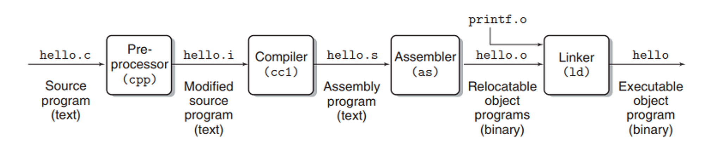

# C

## CMake
CMake는 크로스 플랫폼 빌드 자동화 도구이다. 프로젝트의 빌드 프로세스를 구성하는데 도움을 주는 오픈 소스 도구이다. CMake를 사용하면 여러 플랫폼에서 동일한 소스 코드로 소프트웨어를 빌드하기 편리해진다.

CMake는 간단한 스크립트 언어를 사용하여 프로젝트의 빌드 및 컴파일 구성을 정의한다. 이 스크립트는 'CMakeLists.txt' 파일에 기록되며, 이 파일은 프로젝트 루트 디렉토리에 위치힌다. CMake는 이러한 스크립트를 읽어서 적절한 빌드 시스템 파일을 생성하고, 이를 사용하여 소프트웨어를 빌드한다.

## Compiler
컴파일은 어떤 언어의 코드를 다른 언어로 바꿔주는 과정이다. 사람이 인식하고 이해할 수 있는 프로그래밍 언어로 작성된 코드를 컴퓨터가 이해할 수 있는 기계어로 바꿔주는 것이다.

### GCC(GNU Compiler Collection)
gcc는 GNU 컴파일러 모음으로 C언어로 만든 파일을 컴파일 하기 위한 컴파일러들의 모음이다.
- **GNU**: GNU는 GNU's not UNIX의 재귀 약자로, 리처드 스톨먼이 각종 자유 소프트웨어들이 돌아가고 번영할 수 있는 기반 생태계를 구축하기 위해 시작한 프로젝트이다.
- **g++**: gcc와 마찬가지로 GNU 컴파일러들 중에 C++ 언어로 만든 파일을 컴파일 할 때 사용하는 컴파일러이다.

### 소스 코드가 실팽 파일이 되는 과정

1. 전처리 단계: 전처리기가 소스 파일 내의 전처리기 지시자를 처리한다. (#include, #define 같은 코드 처리)
2. 컴파일 단계: 전처리도니 파일로부터 어셈블리어로 된 파일을 생성한다. (.i 확장자 -> .s 확장자)
3. 어셈블 단계: 어셈블리어 파일을 기계어로된 오브젝트 파일로 변환한다. (.s 확장자 -> .o 확장자, 0과 1로 이루어진 2진수 코드로 변환)
4. 링크 단계: 작성한 프로그램이 사용하는 다른 프로그램이나 라이브러리를 가져와서 연결하는 과정이다. (그 결과로 실행 가능한 파일 생성)

## 1. C 프로그래밍의 구성

### 1-1. 소스코드(source file) 작성 
소스 파일은 C언어로 코딩하여 프로그램을 작성한 파일이다. 소스 파일의 확장자는 *.c이다. 

### 1-2. 컴파일(compile)
컴파일은 코딩이 완료된 문서를 컴퓨터가 이해하는 기계어로 변역하는 단계이다. 사람이 만든 소스 파일을 기계가 이해할 수 있는 기계어로 변환한다. 컴파일된 코드의 확장자는 *.obj이다.

### 1-3. 링크(link)
링크는 컴파일을 통해 기계어로 번역되어 만들어진 오브젝트 파일(.obj)을 하나로 통합하여 실행 파일을 만드는 단계이다. 링크된 파일의 확장자는 .exe이다.

### 1-4. 빌드(build)
컴파일과 링크를 수행하는 과정 전체를 빌드라고 한다. 

## 2. C 프로그램 코드 작성

    #include <stio.h>
    
    int main(void)
    {
    /*
    printf 내부에 적한 사과를 출력하는 프로그
    */

    printf("사과");

    return 0;
    }

### 2-1. #include
특수문자 #은 전처리기(Preprocessor)를 의미한다. 컴파일러가 컴파일을 수행하기 전에 먼저 처리되기 때문에 전처리기라고 한다. 

### 2-2. <stdio.h>
입출력을 위한 헤더 파일이다. 헤더 파일은 필요한 함수를 사용하기 위해 포함시키는 파일을 말하며 확장자는 *.h이다.  
(<>)기호를 사용해서 가져오는 헤더 파일은 시스템 헤더 파일이고, (" ")기호를 사용해서 가져오는 헤더 파일은 사용자 헤더 파일이다.

### 2-3. main()
main()함수는 프로그램이 실행될 때 가장 먼저 호출되는 함수이다. 이 함수는 운영체제가 호춯한다. 가장 먼저 시작되고, 가장 나중에 종료된다.  
main 앞의 int는 출력의 형태를 의미하고, main은 함수의 이름을 의미하며 (void)는 함수의 입력 형태를 의미한다.

### 2-4. /* ~ */
주석을 의미한다.

### 2-5 return
리턴은 반환과 종료의 의미를 갖는다. 함수를 호출한 영역으로 값을 반환한다는 의미와, 함수를 종료한다는 의미를 가진다.

## 3. 컴파일

    % gcc -o {생성할 파일명} {컴파일할 파일명}

## 4. 실행

    % ./{생성된 파일명}
