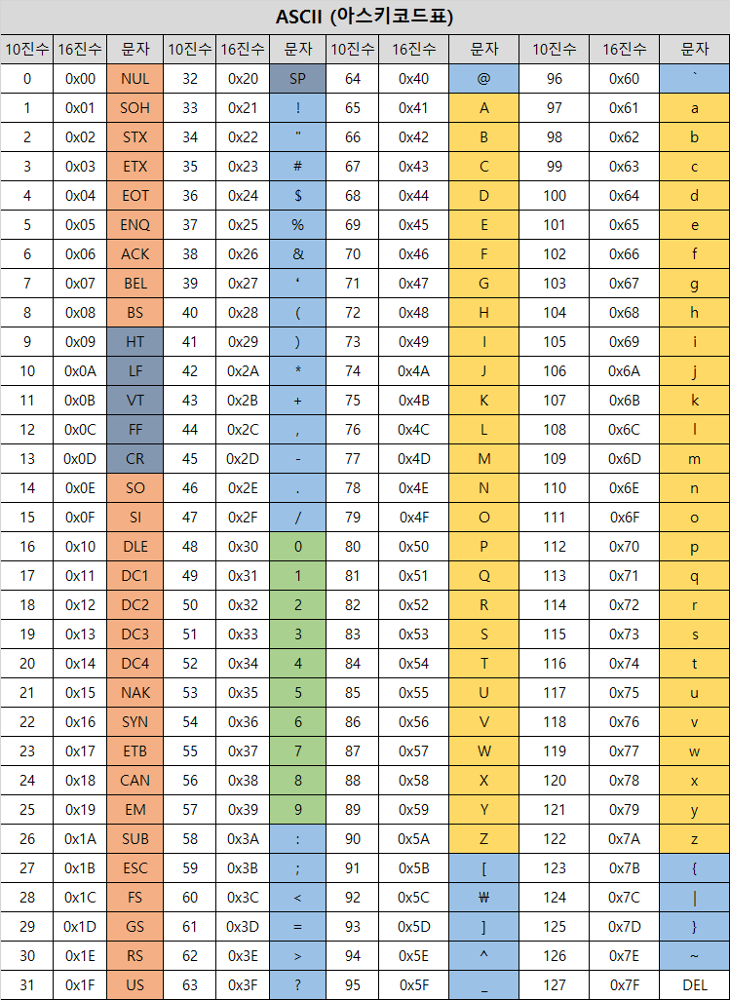
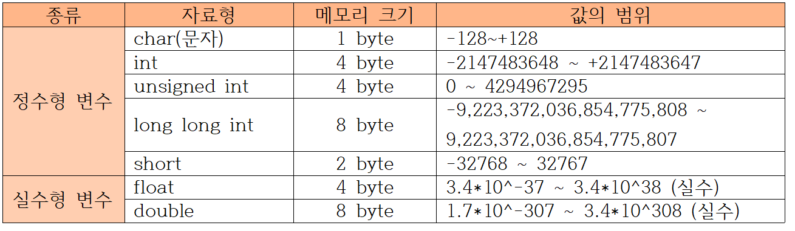
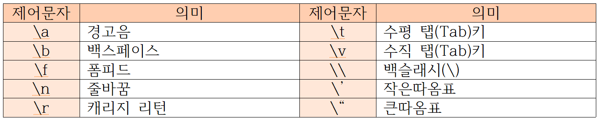
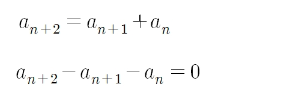

# C

[open tutorials](https://opentutorials.org/module/5371/30467)  

## 1. C언어의 기초

### 1-1. include와 헤더 파일

헤더 파일이란 C언어의 함수, 변수, 매크로, 데이터 구조 등의 선언을 가지고 있는 파일이다. 이러한 선언들로 인해 컴파일러는 프로그램의 다른 부분에서 작성된 코드를 어떤 형식으로 사용하는지 알게 된다.

    // 해더파일 삽입 방법
    #include <stdio.h>
    #include <stdlib.h>

### 1-2. main 함수

C언어로 작성된 프로그램은 main()함수부터 시작하게 된다. 만약 main()함수의 반환값을 정하지 않으면 무조건 0으로 반환된다.

    #include <stdio.h>
    #include <stdlib.h>

    int main() {
        // coding 
        return 0;
    }

### 1-3. 세미콜론과 주석 달기

함수 안에서는 무조건 문장 하나가 끝날 때 세미콜론(;)을 붙여줘야 한다.(함수 바깥에서는 예외 존재) 그렇지 않으면 컴파일러가 컴파일 하지 못한다.  

    // 한줄 전체 주석

    /* 이 주석은 시작과 끝이 나타나 있어서 이 뒤에 코드를 작성 할수 있다. */ printf("hello world")

### 1-4. 변수

    int a;                  // a는 정수형 변수이고, 값은 미정이다. 
    float f = 0.123456;     // f는 실수형 변수이고, 값은 0.123456이다.
    char c = 'A';           // c는 문자형 변수이고, 값은 'A'이다.
    char C = 65;            // C는 문자형 변수이고, 값은 'A'이다. (아스키코드 상의 값)
    char s[6] = "Korea";    // s는 문자열이고, 값은 {K, o, r, e, a, NULL}이다. 

### 1-5. 변수의 형태

- int: (-21억 ~ +21억)
- unsigned int: (1 ~ 42억)
- float: (-21억 ~ +21억, 소숫점 6자리 까지만)
- char: (ASCII, 문자의 번호)
- string: (문자열)

### 1-6. 상수 #define

    #define A 10    // 상수 A에 10 할당

### 1-7. 알고 있으면 유용한 함수들

    #include<math.h>

    // 이 함수를 사용하기 위해서는 double로 cast 해줘야한다.
    double var1 = abs(x);       // x의 절대값
    double var2 = pow(x,y);     // x의 y제곱
    double var3 = sqrt(x);      // 루트 x

 
 

## 2. 입력과 출력

### 2-1. 출력 함수 : printf

    printf("hello world!");

### 2-2. 변환 문자와 기호 문자

    printf("%d", 134)       출력 >> 134
    printf("%f", 0.1)       출력 >> 0.100000
    printf("%g", 0.1)       출력 >> 0.1
    printf("%c", 'a')       출력 >> a
    printf("%s", "hello")   출력 >> hello
    printf("5%%");          출력 >> 5%

### 2-3. 입력 함수 : scanf

    int a, b;               // 정수타입의 a, b 선언
    scanf("%d %d", &a, &b); // scanf 함수로 a, b의 값을 사용자의 입력값으로 정한다.
    printf("%d %d", a, b);  // printf 함수로 a, b의 값을 출력한다.

### 2-4. cast 연산자
cast는 프로그래밍에서 데이터 타입을 다른 데이터 타입으로 변환하는 작업을 말한다.

    int a = 65; 
    // 정수형이였던 a를 (char) cast연산자를 사용해서 문자형으로 변환
    printf("%c", (char)a);  출력 >> a

 
 

## 3. 조건문

### 3-1. 조건식
C언어는 조건식이 참일 때는 1을 반환하고, 거짓일 때는 0을 반환한다. 다른 숫자들도 0만 아니면 참으로 인식한다.

    int a=1, b=2;

    a == b;     출력 >> 0 
    a != b;     출력 >> 1
    a > b;      출력 >> 0
    a < b;      출력 >> 1
    a >= b;     출력 >> 0
    a <= b;     출력 >> 1

    a == b && a <= b;   출력 >> 0
    a == b || a <= b;   출력 >> 1
    !a == b;            출력 >> 1

### 3-2. 조건 연산자(삼항 연산자)

    (조건식) ? 참일 때 반환값 : 거짓일 때 반환값;

### 3-3. if문(조건문)

    if (조건식1){
        // 코드 블록 1
    }
    else if (조건식2){
        // 코드 블록 2
    }
    else {
        // 코드 블록 3
    }
    
### 3-4. switch-case(정렬 조건문)

    switch (조사할 변수) {   
    case constant1:
        // 코드 블록 1
        break;          // break 쓰지 않으면 그 밑으로 쭉 내려가면서 실행된다.
    case constant2:
        // 코드 블록 2
        break;
    default:
        // 만약 어떤 case에도 해당하지 않을 때 실행할 코드
    }

 
 

## 4. 반복문

### 4-1. for : 횟수로 반복하는 방법

    // 10번 반복하는 코드
    for(int i = 0; i < 10; i++){
        // 코드 블록
    }

### 4-2. while : 조건으로 반복하는 방법

    // 조건식이 참인 경우 반복
    while(조건식){
        // 코드 블록
    }

### 4-3. do-while

    // 일단 한 번 실행하고, 조건식이 참인 경우 반복 
    do {
        // 코드 블록
    }while(조건식)

### 4-4. break, continue

    continue;   // 밑에 코드를 무시하고 다음 반복으로 넘어가기
    break;      // 반복문 탈출하기

### 4-5. 반복문의 활용

#### EOF(End of File) 매크로 상수
EOF는 파일의 끝을 나타내거나 입력 작업을 종료할 때 사용되는 매크로 상수이다. <stdio.h>에서 #define(상수)으로 EOF를 정의해놨다.  
C언어에서는 -1로 표현되지만, 파일에서 데이터를 읽을 때, EOF가 나타나면 파일의 끝에 도달했음을 의미하고, 입력 중에는 사용자가(^Z)를 누르면 EOF로 받아들여 입력이 끝났음을 알릴 수 있다.

    int a;
    while(1){
        scanf("%d", &a);
        
        // EOF 입력이 들어오면 중지하는 조건문
        if(a == EOF){
            break;
        }
        else{
            pritnf("%d", a * 2);
        }
    }

#### 유클리드 호제법
유클리드 호제법은 두 수의 최대 공약수를 소인수분해 없이 구할 수 있는 방법이다.  
- 두 수 중에서 큰 수를 a, 작은 수를 b라고 하고 a를 b로 나눈다.
- a가 b로 나누어떨어지면, 두 수의 최대 공약수는 b이다.
- a가 b로 나누어떨어지지 않으면, a를 b로 나눈 나머지와 b에 대해 1번부터 다시 반복한다.
######
    int a, b, c, d, e, gcd, lcm;

    while (1)
    {
        scanf("%d %d", &a, &b);

        if(a == 0 || b == 0)
        {
            printf("END");
            return 0;
        }
        if(a > b)
        {
            c = a;
            d = b;
        }
        else
        {
            c = b;
            d = a;
        }

        while (1)
        {
            e = c % d;
            if(e == 0)
            {
                gcd = d;
                lcm = a * b / gcd;
                printf("%d %d\n", gcd, lcm);
                break;
            }
            c = d;
            d = e;
        }
    }

 
 

## 5. 배열

### 5-1. 배열의 특징과 선언 방법

### 5-2. 배열의 차원

### 5-3. 배열과 반복문의 관계

### 5-4. 문자열 배열

#### NULL

#### gets, puts

#### #include <string.h>

### 5-5. 배열의 활용편

#### #include <time.h>

#### Select Sort

 
 

## 6. 함수

### 6-1. 나만의 함수 만들기

    // 반환값이 없는 경우 함수형을 void로 한다.
    void 1_plus_2(){
        printf("%d", 1+2);
        return;
    }

    int main() {
        1_plus_2();
    }

### 6-2. 선언과 정의

    int add(int a, int b){
        return a+b;
    }

    int main() {
        add(1, 2);
        return 0;
    }

위와 같이 선언과 정의가 동시에 되어 있으면 main함수를 보기 어려워진다. 따라서 위에서 함수를 선언만 해두고 함수는 밑에서 따로 정의하기도 한다.

    int add(int a, intb);

    int main() {
        add(1, 2);
        return 0;
    }

    int add(int a, int b) {
        return a+b;
    }

### 6-3. 매개변수
함수에 매개변수로 배열을 입력하는 경우 배열의 길이는 비워둔다. 단, 다차원 배열의 경우 첫번째 배열만 비워두고 2번째, 3번째 부분은 정확히 채워야한다.

    int ArrSum(int array[]);
    int ArrXArrSum(int array[][10]);

### 6-4. 재귀함수

#### 재귀함수의 특징과 선언 방법
재귀 함수는 return을 활용해 처음으로 돌아가는 무한루프 함수이다. 

    // 팩토리얼
    int factorial (int n) {
        if (n == 1) return 1;
        return n * factorial(n-1);
    }

### 6-6. 재귀함수의 활용

#### 유클리드 호제법(2)

    int gcd(int a, int b) {
        if (b == 0) return a;
        return gcd(b, a % b);
    }

#### 피보나치 수열

    int fibo(int n) {
        if (n <= 2) return 1;
        return fibo(b-1) + fibo(n-2);
    }

 
 

## 7. 포인터

### 7-1. 포인터 변수와 주소값; 참조와 역참조

### 7-2. 포인터와 함수; Call by Reference

### 7-3. 구조체 포인터; 포인터 연산자

 
 

## 8. 구조체

#### 구조체의 뜻과 종류; struct와 typedef struct

#### 포인터 구조체

#### 연결 리스트